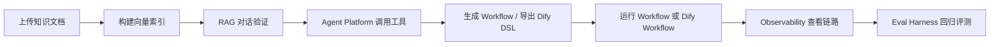

# 面试展示系统完善文档

> 目标：把当前项目整理成一个“流程能跑通、问题讲得清、后续可演进”的 AI Agent 平台展示系统。本文基于 2026-06-12 对代码、文档、前端页面和构建结果的检查。

## 1. 当前系统定位

项目已经不是单一聊天 Demo，而是一个围绕 AI Agent 应用搭建的综合平台：

- 后端主服务：Spring Boot 3 + Spring AI，提供对话、RAG、工具调用、Manus/ReAct、Agent Platform、Workflow、Dify、Eval、Observability 等接口。
- 前端控制台：Vue 3 + Vite，包含 Home、Assistant、Manus、KnowledgeBase、Skills、AgentPlatform、Workflow、Dify、Eval 等页面。
- 知识库能力：文档上传、解析、切片、向量化、PGVector 检索。
- 工具和 Skill 能力：本地工具、Skill Registry、OpenAPI 导出、MCP 图片搜索子服务。
- 可观测性能力：request/session/trace 维度日志，阶段日志覆盖输入、检索、模型、工具、输出。
- 评测能力：Eval Suite、Runner、Judge，已具备用例驱动回归的雏形。
- Workflow/Dify 能力：支持自然语言生成简单 Workflow、导出 Dify DSL、调用 Dify Workflow。

面试时建议将系统定位为：

> “一个以 Spring AI 为核心，覆盖 RAG、Tool Calling、ReAct Agent、Workflow 编排、Dify 集成、可观测性和评测闭环的 AI Agent 工程化平台。”

## 2. 当前验证结果

| 验证项 | 命令 | 结果 | 说明 |
| --- | --- | --- | --- |
| 后端编译 | `.\mvnw.cmd -q -DskipTests compile` | 通过 | Java 代码能完成编译。 |
| 后端测试 | `.\mvnw.cmd -q test` | 失败 | 多个 `@SpringBootTest` 因未配置 datasource，启动上下文失败。 |
| 前端构建 | `npm.cmd run build` | 通过 | Vite 构建通过，产物在 `vs-agent-web/dist/`。 |
| PowerShell npm | `npm run build` | 被拦截 | Windows 执行策略禁止 `npm.ps1`，本机建议用 `npm.cmd`。 |

测试失败主因：

- 测试没有激活稳定的 `test` profile。
- 当前 Spring 上下文依赖 DataSource、AI Client、Observability Repository 等外部配置。
- 缺少 H2/Testcontainers/Mock Bean 兜底，导致不连真实 PostgreSQL 时无法跑完整测试。

## 3. 现有 Bug 与风险清单

### P0：面试展示前必须处理

| 问题 | 影响 | 涉及位置 | 建议处理 |
| --- | --- | --- | --- |
| 测试套件无法一键通过 | 面试官要求现场验证时风险高；也影响 CI 可信度。 | `src/test/**`、`pom.xml`、配置文件 | 新增 `application-test.yml`，用 H2 或 Testcontainers；对 LLM/外部搜索做 Mock；让 `mvn test` 至少稳定通过核心单测。 |
| 大量中文文案/注释乱码 | 首页、控制台、异常信息、文档展示效果差，面试观感受损。 | `README.md`、`ROADMAP.md`、`PROJECT_MODULE_OVERVIEW.md`、`vs-agent-web/src/views/**`、部分 Java 字符串 | 统一转 UTF-8，重新写关键展示文案；优先修复 Home、AgentPlatform、Workflow、Dify、Eval 页面。 |
| 演示链路依赖外部服务过多 | PostgreSQL、PGVector、DashScope/OpenAI、搜索 API、图片 API、Dify、MCP 任一不可用都会断链。 | 后端配置、Dockerfile、Dify/MCP 相关模块 | 准备“一键演示 profile”：本地 PG/Dify 可选启动，外部搜索和 LLM 提供 mock/fallback。 |
| Workflow Builder 仍是 MVP | 目前主要生成 `Start -> LLM -> Answer`，离复杂编排还有距离。 | `workflowbuilder/**`、`docs/WORKFLOW_BUILDER.md` | 面试时明确为 MVP；下一步补 Tool、Knowledge Retrieval、If/Else、Dify 导入稳定性。 |
| 可展示主线还未固化 | 页面很多，但面试时容易分散，不能体现端到端价值。 | 前端 Home/各模块 | 固定一个“知识上传 -> RAG/Agent -> Workflow -> 观测 -> Eval”的演示脚本。 |

### P1：影响稳定性和工程质量

| 问题 | 影响 | 建议处理 |
| --- | --- | --- |
| SSE 接口使用 GET query 传长文本 | 长 prompt、中文、换行、特殊字符容易超过 URL 限制或编码异常。 | 增加 POST + SSE/WebFlux 方案，保留 GET 作为兼容入口。 |
| Observability 基于 `ThreadLocal`，异步/SSE/Reactor 场景可能丢 trace | 流式输出、异步文档处理、工具超时后链路不完整。 | 对 Reactor Context、异步线程池做 trace 透传；为每个工具/任务步骤显式传 `traceId`。 |
| `WorkflowRegistry` 是内存实现 | 服务重启后生成的 Workflow 丢失。 | 使用 PostgreSQL 持久化 WorkflowDef 和版本。 |
| `SkillRegistry` 也是内存注册表 | 当前适合启动扫描，不适合运行期动态管理。 | 增加文件目录扫描刷新、数据库元数据、启停状态。 |
| Tool 超时使用 `CompletableFuture.supplyAsync` 默认线程池 | 超时后底层任务未必取消，且线程池不可控。 | 改为受控 `ExecutorService`，补取消、限流和隔离。 |
| Dify 失败也返回 `ApiResponse.success(result)` | 前端和调用方需要二次判断 `result.success`，容易误判。 | API 层统一错误语义，同时保留原始 Dify 错误。 |
| API 响应类重复 | `knowledgebase.vo.ApiResponse`、`observability.vo.ApiResponse` 等重复。 | 抽一个全局响应对象，统一 code/message/data。 |
| Skill OpenAPI server 写死 `localhost:8081/api` | Docker、局域网、Dify 容器导入时地址不匹配。 | 从配置读取 public base url。 |
| 知识库上传缺少大小/类型/安全边界 | 大文件、恶意文件、解析失败会影响稳定性。 | 增加文件大小限制、MIME 校验、解析沙箱、失败重试。 |
| Eval 结果尚未形成趋势面板 | 当前能跑 suite，但还没形成持续改进闭环。 | 保存历史评测结果，前端展示模型/Prompt/Workflow 对比。 |

### P2：展示体验和产品化优化

- 前端页面已有入口但信息密度和视觉一致性需要统一。
- README/ROADMAP 内容较多，但应增加“5 分钟启动”和“10 分钟面试演示脚本”。
- Dockerfile 存在，但缺少统一 `docker-compose.demo.yml` 编排后端、前端、PostgreSQL、Dify、MCP。
- 缺少固定样例数据：示例知识文档、示例问题、示例评测 suite、示例 workflow。
- 缺少权限和安全边界：终端工具、文件工具、下载工具在面试项目中需要解释 sandbox 策略。

## 4. 未完成部分

### 4.1 Skill 体系

已完成：

- `Skill` 抽象、`SkillMetadata`、`SkillRegistry`、`SkillController`。
- Skill OpenAPI 导出。
- PDF Skill 示例。

未完成：

- 现有 `tools/*Tool.java` 还没有全部迁移为 Skill。
- Skill 参数 schema 还较弱，缺少复杂对象、枚举、默认值、示例值。
- 缺少运行期启停、版本管理、权限控制。
- MCP 暴露 Skill 的链路还需要稳定验收。

### 4.2 Workflow / Dify

已完成：

- 自然语言生成 WorkflowDef / WorkflowIR 的雏形。
- Java 内部 Workflow 执行。
- Dify DSL 导出。
- Dify run / health 接口。
- Workflow Builder 导入 Dify 的 Console Client 草案。

未完成：

- Workflow Builder 目前还是规则生成，未真正让 LLM 规划多节点 IR。
- Dify DSL 与不同 Dify 版本的兼容性需要实测。
- Tool 节点、知识检索节点、条件分支、循环、人工确认节点未完成。
- Dify trace 与本地 Observability 的链路贯通还需补。

### 4.3 Eval Harness

已完成：

- Suite/Case/Runner/Judge 基本抽象。
- Keyword Judge、LLM-as-Judge 雏形。
- 前端 Eval 页面入口。

未完成：

- 缺少可稳定离线运行的 demo suite。
- LLM-as-Judge 需要独立模型配置和评分 rubric。
- Eval 结果没有落库和趋势对比。
- CI 尚未接入。

### 4.4 Observability

已完成：

- HTTP 请求级 trace。
- 请求主表和阶段日志。
- 工具执行日志包装。
- 前端查询入口。

未完成：

- Reactor/SSE/异步任务 trace 透传。
- 大模型 token、耗时、费用、重试次数统计。
- 端到端链路视图：用户请求 -> RAG -> Tool -> Model -> 输出。
- 评测结果与 trace 的跳转联动。

## 5. 面试展示闭环设计

建议将最终可展示系统收敛成一个固定主线：

### 推荐演示业务场景

优先选择“简历/JD 分析助手”或“论文综述助手”，原因：

- 输入材料容易准备，不依赖敏感数据。
- RAG、信息抽取、总结、工具调用、评测都能自然串起来。
- 面试官容易理解业务价值。

建议演示脚本：

1. 上传一份 JD 或论文摘要到知识库，展示文档状态从 `PENDING` 到 `SUCCESS`。
2. 在 Assistant 页面提问，走 RAG，回答中体现知识库内容。
3. 在 Agent Platform 运行 Demo Task，展示搜索/图片搜索/总结工具编排。
4. 在 Workflow 页面输入“抽取 JD 中的岗位、地点、技能要求，输出 JSON”，生成工作流。
5. 导出 Dify DSL 或调用 Dify Workflow，说明 Dify 用于可视化编排，自研平台负责工具、日志和评测。
6. 打开 Observability，按 requestId/sessionId 查看完整执行链路。
7. 打开 Eval，运行固定 suite，展示通过率、失败 case 和改进方向。

## 6. 推荐修复顺序

### 第一阶段：先让演示稳定

目标：本机 10 分钟内能启动并跑通主线。

- 修复前端和关键 Java 异常文案乱码。
- 新增 `application-demo.yml`，统一配置后端端口、PG、LLM、Dify、MCP。
- 新增 `docker-compose.demo.yml`，至少包含 PostgreSQL + pgvector。
- 准备示例知识文档、示例 prompt、示例 eval suite。
- 保留 mock/fallback：外部搜索失败时返回固定示例结果，避免现场断链。

验收：

- `npm.cmd run build` 通过。
- `.\mvnw.cmd -q -DskipTests compile` 通过。
- 后端能用 demo profile 启动。
- 前端首页无乱码，所有导航入口能打开。

### 第二阶段：补测试和质量基线

目标：给面试官一个可信的工程化证据。

- 增加 `application-test.yml`。
- 对 SpringBootTest 激活 test profile。
- 使用 H2/Testcontainers 或 Mock DataSource。
- Mock ChatModel、搜索 API、Dify Client。
- 让 `mvn test` 稳定通过，至少覆盖 WorkflowBuilder、Skill、Tool、KnowledgeBase 核心服务。

验收：

- `.\mvnw.cmd -q test` 通过。
- 输出一份测试覆盖说明，能解释哪些是单测、哪些是集成测试。

### 第三阶段：完善端到端闭环

目标：把“功能页面集合”变成“可讲清楚的平台”。

- 固化一个端到端 demo flow。
- Workflow 增加 Tool 节点和 Knowledge Retrieval 节点。
- Observability 增加链路详情页跳转。
- Eval 结果落库，支持历史对比。
- Skill OpenAPI base url 配置化。

验收：

- 从前端可完成：知识上传 -> RAG 问答 -> Workflow 生成/执行 -> Trace 查询 -> Eval 评测。
- 任一失败节点有明确错误提示，不出现乱码或空白页。

## 7. 面试讲解结构

建议按 4 层讲：

1. 应用层：Assistant、Manus、Workflow、Dify、Eval 页面解决什么问题。
2. 编排层：TaskOrchestrator、WorkflowExecutor、Dify Bridge 如何组织多步任务。
3. 能力层：RAG、Tool、Skill、MCP 如何统一变成模型可调用能力。
4. 工程层：Observability、Eval、配置、Docker、测试如何保证可维护和可回归。

可以重点突出：

- “不是只调 API，而是把 AI 应用工程化：能力注册、编排、观测、评测都做了。”
- “自研编排和 Dify 不是二选一：自研负责稳定执行和平台能力，Dify 负责可视化和低代码编排。”
- “Eval 和 Observability 是闭环：失败 case 能定位到具体请求链路，再反向改 Prompt、知识库或工具。”

## 8. 最终交付标准

面试前建议达到以下标准：

- 首页、核心页面、README 无明显乱码。
- 一条端到端演示链路可跑通。
- 一条后端编译命令和一条前端构建命令可稳定通过。
- 至少一组后端测试可稳定通过，最好 `mvn test` 全绿。
- 外部服务不可用时有 mock/fallback，不影响主线讲解。
- 文档包含启动方式、演示脚本、架构图、已知限制和后续计划。

## 9. 当前最短可行版本

如果时间有限，优先做到：

1. 修乱码：Home、AgentPlatform、Workflow、Dify、Eval、README。
2. 做 demo profile：固定 PG/LLM/搜索 mock 配置。
3. 固化演示数据：1 个知识文档、1 个 Workflow prompt、1 个 Eval suite。
4. 修测试配置：至少让 WorkflowBuilderTest 和纯工具测试稳定跑；再逐步让全量 `mvn test` 通过。
5. 准备讲解稿：按“RAG -> Tool/Agent -> Workflow/Dify -> Observability -> Eval”讲。

这样即使系统还不是生产级，也能在面试中展示出完整工程思路和可持续演进路线。
