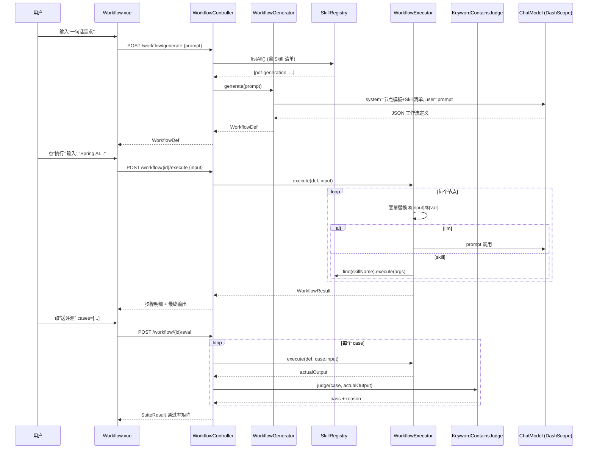

# vs-ai-agent 项目指南

> 一份「作者自己拿来验证」的操作手册。涵盖：项目当前能力、模块边界、启动顺序、9 个闭环的 UI 路径 + REST 端点 + 数据流 + 验证 curl，以及"哪些是真做了 / 哪些是 MVP 占位"的诚实说明。

---

## 0. 项目一句话定位

基于 **Spring Boot 3 + Spring AI + PostgreSQL/PGVector + Vue 3** 的多形态 AI 应用平台。当前已经收敛出 9 个独立可点、UI 可见、后端真跑的能力闭环；最大亮点是「**一句话生成 Workflow → 解释执行 → 自动评测 → 一键导出 Dify YAML**」单页串完整链路。

---

## 1. 整体架构

```
┌────────────────────────────────────────────────────────────────────────┐
│  Vue 3 前端 (vs-agent-web, :5173)                                       │
│  Home → 9 卡片：AssistantApp / Manus / KB / Skills / AgentPlatform     │
│                  Workflow ★ / Dify / Eval / Observability              │
└──────────────────────────────┬─────────────────────────────────────────┘
                               │ HTTP / SSE
                               ▼
┌────────────────────────────────────────────────────────────────────────┐
│  主后端 vs-ai-agent (Spring Boot, :8081, context-path /api)            │
│                                                                        │
│  app/AssistantApp ──┐                                                 │
│  agent/VsManus ─────┤ → ChatClient / ToolCallback / Advisor           │
│  skill/ ────────────┤                                                 │
│  agentplatform/ ────┤                                                 │
│  rag/ + knowledgebase/                                                │
│  workflow/ (NL → DSL → exec → eval → Dify YAML)                       │
│  eval/ (suite/runner/judge/report)                                    │
│  dify/ (HTTP client + OpenAPI export)                                 │
│  observability/ (trace/request/session, stage logs)                   │
└────┬───────────────────────┬───────────────────────┬───────────────────┘
     │JDBC                   │MCP (SSE/stdio)        │HTTP
     ▼                       ▼                       ▼
┌───────────────┐  ┌────────────────────────┐  ┌──────────────────────┐
│ PostgreSQL    │  │ vs-image-search-mcp    │  │ DashScope / SerpAPI  │
│ + pgvector    │  │ (独立 MCP 子服务)      │  │ Dify / Image API     │
└───────────────┘  └────────────────────────┘  └──────────────────────┘
```

### 主要技术栈

| 层 | 选型 |
| --- | --- |
| 语言/框架 | Java 21、Spring Boot 3、Spring MVC、Reactor `Flux` |
| AI 能力 | Spring AI（ChatClient / ToolCallback / Advisor / VectorStore / ChatMemory / MCP） |
| 模型 | DashScope（通义），可配置切换 |
| 数据持久化 | PostgreSQL 15 + pgvector（HNSW、cosine、1536 维） |
| 前端 | Vue 3 + Vite + Vue Router + Pinia + Axios + EventSource |
| 协议 | OpenAPI（Knife4j/Springdoc）、MCP（SSE / stdio）、Dify Workflow API |
| 容器化 | Docker（backend / frontend / mcp 三个 Dockerfile） |

---

## 2. 启动顺序（必看）

### 2.1 前置依赖

- JDK **21**
- Maven 3.8+
- Node 18+
- PostgreSQL 15+，已装 `pgvector` 扩展
- 一个 DashScope API key（或其它兼容 OpenAI 的模型 key）
- 可选：Dify 实例（仅 `/dify` 页面用到，未配置时页面会给"未配置"提示，其它 8 个闭环不受影响）

### 2.2 配置项清单

复制 `src/main/resources/application-xxxxx.yml` → `application-local.yml`，填以下字段：

```yaml
spring:
  ai:
    dashscope:
      api-key: <your-key>
      chat:
        options:
          model: qwen-plus            # 或其它可用模型
          stream: true
    mcp:
      client:
        sse:
          connections:
            server1:
              url: http://localhost:8082    # MCP 子服务地址（可选）
        enabled: true
  datasource:
    url: jdbc:postgresql://localhost:5432/your_db
    username: postgres
    password: postgres

server:
  port: 8081
  servlet:
    context-path: /api

# 工具用的外部 API（可选；不配则对应工具失败但不影响启动）
search-api:
  api-key: <serpapi-key>
image-api:
  api-key: <image-search-key>

# Dify 集成（可选）
app:
  dify:
    base-url: https://api.dify.ai      # 或自建 Dify 的 IP:Port
    api-key: app-xxxxxxxx
    default-workflow-id:               # 可选
    timeout-ms: 60000
  kb:
    dashscope:
      index: assistant_kb              # Dify 知识库索引名（可选）
```

PG 中执行一次：

```sql
CREATE EXTENSION IF NOT EXISTS vector;
```

### 2.3 启动

```bash
# 后端（必须）
./mvnw spring-boot:run -Dspring-boot.run.profiles=local
# 看到日志含：[skill-scanner] registered N skills, [eval] runners={...} judges={keyword_contains, llm_as_judge}

# 前端（必须）
cd vs-agent-web
npm install
npm run dev
# 打开 http://localhost:5173

# MCP 子服务（可选，用 /skills 的 image 类工具时才需要）
cd vs-image-search-mcp-server
./mvnw spring-boot:run -Dspring-boot.run.profiles=sse
```

### 2.4 启动后冒烟自检（30 秒）

```bash
curl -s http://localhost:8081/api/skills            | head -c 200; echo
curl -s http://localhost:8081/api/agent-platform/tools | head -c 200; echo
curl -s http://localhost:8081/api/eval/suites       | head -c 200; echo
curl -s http://localhost:8081/api/dify/health       | head -c 200; echo
curl -s http://localhost:8081/api/workflow          | head -c 200; echo
```

5 个 200 都返回 `{"code":0,"data":...}` 即代表后端 8 个核心模块全部装配成功。

---

## 3. 9 个能力闭环

每节按统一格式：**UI 路径 → 关键 REST 端点 → 数据流 → 验证步骤**。

### 3.1 AI 助手（AssistantApp）

- **UI 路径**：`/assistant-app`
- **能力**：通用对话（同步/流式）、RAG 检索增强对话、工具调用、MCP 调用、文件 ChatMemory。
- **关键端点**：
  - `GET /api/ai/assistant_app/chat/sync?message=&chatId=`
  - `GET /api/ai/assistant_app/chat/sse?message=&chatId=`
  - `GET /api/ai/assistant_app/chat_rag/sse?message=&chatId=`
- **数据流（RAG 对话）**：
  ```
  前端 EventSource → AiController → AssistantApp.doChatWithRagSse
       → QueryRewriter (可选) → PGVectorStore.similaritySearch (topK=4)
       → QuestionAnswerAdvisor 注入文档 → ChatClient.stream → SSE 增量回包
  全程 TraceContextFilter 注入 traceId；ExecutionLogService 记 RETRIEVAL + MODEL 阶段
  ```
- **验证**：前端 `/assistant-app` 输入问题，应见到流式输出。打开 `/observability` 用 chatId 应能查到 trace。

### 3.2 Manus 超级智能体

- **UI 路径**：`/manus-app`
- **能力**：ReAct 多步推理 + 工具自动选择 + SSE 增量推送每一步。
- **关键端点**：`GET /api/ai/manus/chat?message=&contentText=`
- **数据流**：
  ```
  AiController 实例化 VsManus(allTools, chatModel) → ToolCallAgent.runStream
       → ReAct Loop: 下一步 prompt → 选工具 / 思考 / 调 TerminateTool
       → 每步 Observation 喂回 → 直到终止或达 maxSteps
  ```
- **验证**：输入"搜索 spring ai 并写一段 100 字简介"，应看到多步 SSE。

### 3.3 知识库管理

- **UI 路径**：`/knowledge-base`
- **能力**：拖拽上传 → 自动解析 → 切块 → 向量化入库 → 状态可视 → 重处理 / 重建索引。
- **关键端点**：
  - `POST /api/kb/documents/upload` (multipart: file + source + tags)
  - `GET  /api/kb/documents?limit=`
  - `POST /api/kb/documents/{id}/reprocess`
  - `DELETE /api/kb/documents/{id}`
  - `POST /api/kb/documents/index/rebuild`
- **数据流（入库）**：
  ```
  Upload → KnowledgeBaseService → Tika 抽文本 → DocumentProcessingService 切块
       → DashScope embedding → pgvector 表 → 状态机推进
  ```
- **验证**：拖一个 md/txt 进上传区，看 chunkCount 涨；前端 `/assistant-app` RAG 模式提问，应能召回该文档。

### 3.4 Skill 平台

- **UI 路径**：`/skills`
- **能力**：列出所有已注册 Skill（SKILL.md + Java 实现）→ 动态生成输入表单 → 执行 → 结果（带 PDF 下载按钮）。
- **关键端点**：
  - `GET  /api/skills`
  - `GET  /api/skills/{name}`
  - `POST /api/skills/{name}/execute`
  - `GET  /api/skills/openapi.json` ★ 给 Dify 反向导入用
- **数据流（启动 + 调用）**：
  ```
  启动：SkillScanner 扫 classpath:skills/**/SKILL.md → 解析 YAML front-matter
       → InMemorySkillRegistry.register(skill)
       → SkillAutoConfiguration 把每个 Skill 包成 ToolCallback (可被 ChatClient 注入)

  调用：前端 → SkillController.execute → skill.execute(args, ctx)
       → SkillContext 自动从 TraceContext 拉 traceId
       → 返回 SkillResult{success, data, errorMessage, elapsedMs}
  ```
- **验证**：选 `pdf-generation`，填 `fileName=test.pdf` / `content=hello`，执行 → 结果面板出现 `filePath` + 下载按钮 → 点下载得到真实 PDF。

### 3.5 Agent 平台

- **UI 路径**：`/agent-platform`（两个 tab）
- **能力**：
  - **Tools tab**：列出 `ToolRegistry` 中所有 AgentTool → 表单 → 执行 → 结果
  - **Tasks tab**：一行 query 触发预置 demo 编排；或者 JSON 编辑器自定义多步任务，每步独立结果卡片
- **关键端点**：
  - `GET  /api/agent-platform/tools`
  - `POST /api/agent-platform/tools/{name}/execute`
  - `POST /api/agent-platform/tasks/execute`
  - `POST /api/agent-platform/tasks/demo`
- **数据流（任务编排）**：
  ```
  TaskOrchestratorService.execute(request)
       → 按 steps 顺序循环：ToolExecutionService.executeByName
       → 每步落 ToolExecuteResult；汇总到 TaskExecuteResult
       → 全程 LoggingToolCallback 落 TOOL 阶段日志
  ```
- **验证**：Tasks tab 点"运行 Demo 编排"，右侧每一步独立卡片，badge + cost + output 都有。

### 3.6 一句话工作流（★ 重点）

- **UI 路径**：`/workflow`
- **能力**：输入一句话 → LLM 生成 WorkflowDef（含 llm/skill 节点 + 边）→ 自研解释器执行 → 内置 Eval 评测 → 一键导出 Dify YAML（可手动导入 Dify）。
- **关键端点**：
  - `POST /api/workflow/generate`           body `{prompt}`
  - `GET  /api/workflow`                    列出已生成
  - `GET  /api/workflow/{id}`
  - `POST /api/workflow/{id}/execute`       body `{input}`
  - `POST /api/workflow/{id}/eval`          body `{judge, cases:[{id,input,expectedContains?,rubric?}]}`
  - `GET  /api/workflow/{id}/dify-dsl`      返回 YAML 文件
- **数据流（完整闭环）**：
  ```
  ┌─ NL prompt
  │     ↓
  │  WorkflowGenerator.generate
  │     │ - system prompt 注入「可用 Skill 清单 + 节点模板」
  │     │ - ChatClient → 模型输出 JSON
  │     │ - 鲁棒解析（剥 markdown / 抽第一段 {}）
  │     ↓
  │  WorkflowDef {nodes[], edges[], outputVar}
  │     │ - 存入 WorkflowRegistry (内存, key=UUID)
  │     ↓
  ├──→ [execute] input → WorkflowExecutor
  │     │ - variables = {input: ...}
  │     │ - 顺序遍历 nodes:
  │     │     · llm   → render ${var} → ChatClient.user(prompt) → 写 outputVar
  │     │     · skill → render args → SkillRegistry.find(name).execute
  │     │ - 首个失败即中止；返回 WorkflowResult{steps[], output}
  │     ↓
  ├──→ [eval] cases → WorkflowEvalRunner (设 currentWorkflowId via ThreadLocal)
  │     │ - 逐 case 调 executor → judge (keyword_contains 或 llm_as_judge)
  │     │ - 聚合 SuiteResult{passed, failed, totalElapsedMs, cases[]}
  │     ↓
  └──→ [export] DifyDslExporter.toYaml(def)
        │ - 内部 DSL → Dify 风格 app + workflow.graph 结构
        │ - llm 节点 → Dify llm 节点；skill 节点 → Dify tool 节点
        ↓
     用户下载 .yaml，可手动 Import 到任意 Dify 实例
  ```
- **验证（最完整冒烟）**：
  1. 前端 `/workflow` → 输入"把用户输入的话写一份 200 字摘要" → 点生成
  2. 右侧出现 1-2 个节点的可视化（带 `${input}` `${stepN}` 提示）
  3. 输入"Spring AI 是一个 Java AI 框架" → 点执行 → 看每步 input/output
  4. Eval 框默认带两条 case → 点"执行评测" → 看 PASS/FAIL 矩阵
  5. 点"下载 Dify YAML" → 检查文件结构是 `app / kind / workflow.graph`

### 3.7 Dify 双向集成

- **UI 路径**：`/dify`
- **能力**：
  - **Java → Dify**：调用配置好的 Dify Workflow（POST `/v1/workflows/run`）
  - **Dify → Java**：通过 `/skills/openapi.json` 导出 Skill 清单供 Dify 后台导入
- **关键端点**：
  - `GET  /api/dify/health` 配置/连通状态
  - `POST /api/dify/run` body `{workflowId?, inputs, user?, responseMode}`
- **数据流**：
  ```
  调用方向：DifyController.run → DifyClient.run(req)
       → RestTemplate.postForEntity(baseUrl + /v1/workflows/run, Bearer apiKey)
       → 解析 data.status / data.outputs → DifyRunResult{success, outputs, raw}

  反向：SkillOpenApiController.openapi
       → 遍历 SkillRegistry.listAll() → 每个 Skill 包成
         POST /skills/{name}/execute 的 OpenAPI 3.0 path
       → 用户在 Dify 后台「自定义工具集合」处粘贴本 URL 一键导入
  ```
- **验证**：
  - 不配 Dify：页面顶部红点 + "未配置"，OpenAPI 下载按钮仍可用 → 点下载得到合法 JSON spec
  - 配了 Dify：页面绿点 + base URL 显示 → 填 workflow id + inputs JSON → 执行 → 结果面板出 outputs

### 3.8 Eval 评测

- **UI 路径**：`/eval`
- **能力**：左侧列 YAML suite，右侧点"执行 Suite"得到 KPI 面板（总数/通过/失败/通过率/耗时）+ 每条 case 状态徽章 + 展开看 input/actual/missed/原因。
- **当前内置 suite**：
  - `general_qa` — runner=`assistant_app`, judge=`keyword_contains`（4 个客观题）
  - `subjective_qa` — runner=`assistant_app`, judge=`llm_as_judge`（3 个主观题，用 rubric）
- **关键端点**：
  - `GET  /api/eval/suites`
  - `POST /api/eval/run/{suiteName}`
- **数据流**：
  ```
  SuiteLoader.loadAll → 扫 classpath:eval/suites/*.yaml
  EvalService.run(suiteName):
       1. 按 suite.runner() 查 EvalRunner（如 AssistantAppRunner）
       2. 按 suite.judge() 查 EvalJudge（keyword_contains / llm_as_judge）
          - keyword：忽略大小写检查 expected_contains 是否全命中
          - llm：拼 system prompt 让模型按 rubric 输出 {pass, reason} JSON
       3. 对每个 case：runner.run → judge.judge → 写 CaseResult
       4. 聚合 SuiteResult{passed, failed, totalElapsedMs}
  ```
- **验证**：选 `general_qa` 执行 → 看通过率；选 `subjective_qa` 执行 → 看 LLM 裁判给出的 reason。

### 3.9 执行日志面板

- **UI 路径**：`/observability`
- **能力**：按 requestId 查单次完整链路；按 sessionId 查会话下全部请求；按时间窗查失败请求。
- **关键端点**：
  - `GET  /api/observability/requests/{requestId}`
  - `GET  /api/observability/sessions/{sessionId}/requests?limit=`
  - `POST /api/observability/requests/failures` body `{startTime, endTime, limit}`
- **数据流（贯穿所有模块）**：
  ```
  HTTP 进入 → TraceContextFilter
       → 从 Header X-Trace-Id 取；缺则生成
       → TraceContext.set(TraceInfo{traceId, requestId, sessionId})
  各业务方法：
       ExecutionLogService.startRequest → 写主表
       ExecutionLogService.logStage(... INPUT/RETRIEVAL/MODEL/TOOL/OUTPUT ...) → 写阶段明细表
       finishSuccess / finishFail → 更新主表
  工具：LoggingToolCallback 装饰每个工具，前后自动记 TOOL 阶段
  ```
- **验证**：从其它任何页面发一次请求，记 chatId/requestId（响应 header 或 trace），到 `/observability` 输入查到完整链路。

---

## 4. 关键数据流总览

### 4.1 一次工作流端到端（NL → eval 闭环）



### 4.2 Skill 执行 + 文件下载

```
SkillsConsole → POST /skills/pdf-generation/execute
  ↓
SkillController → SkillRegistry.find → AbstractSkill.execute
  ↓ 参数校验 + 计时
PDFGenerationSkill.doExecute → iText → 文件落到 ${user.dir}/tmp/pdf/<name>
  ↓
SkillResult{success, data: {filePath, message}}
  ↓
前端检测 filePath → 渲染下载按钮
  ↓ GET /files/download?path=...
FileDownloadController → 校验路径在 FILE_SAVE_DIR 下 → 返回文件流
```

### 4.3 Dify 双向

```
       Java                              Dify
  ┌─────────────┐                  ┌──────────────┐
  │ DifyClient  │  Bearer + JSON   │  /v1/        │
  │  .run(req)  │ ────────────────▶│  workflows/  │
  │             │                  │  run         │
  └─────────────┘                  └──────────────┘

  ┌─────────────┐  GET openapi     ┌──────────────┐
  │ SkillOpen   │ ────────────────▶│ Dify 后台    │
  │ ApiCtrl     │                  │ 自定义工具   │
  └─────────────┘   (用户复制 URL)  │ 集合导入     │
                                   └──────────────┘
  之后 Dify Workflow 节点可调      ─┐
  POST /skills/{name}/execute      ─┘
```

---

## 5. 能力边界（诚实清单）

### ✅ 真做了 + 可演示

| 能力 | 状态 |
| --- | --- |
| Spring AI Chat / RAG / Tools / MCP | 真跑，依赖 DashScope key |
| SkillRegistry + SKILL.md 扫描 + ToolCallback 适配 | 完整 |
| Skill OpenAPI 3.0 spec 自动导出 | 真在 `/skills/openapi.json` |
| 知识库 upload→parse→split→embed→index | 真跑 |
| AgentPlatform 工具/任务编排 | 真跑 |
| NL→Workflow 生成 + 解释执行 + 评测接入 | 真跑（关键卖点） |
| Workflow → Dify YAML 导出 | 文件生成正常；schema 是「Dify 兼容骨架」 |
| Eval Harness：keyword_contains + llm_as_judge | 真跑，YAML 数据集，REST + UI 报告 |
| Observability：trace/request/session + 阶段日志 | 真跑，落 PG |
| Dify 调用：POST /v1/workflows/run | 真跑，需要配 `app.dify.*` |

### ⚠ MVP / 占位 / 受限

| 能力 | 说明 |
| --- | --- |
| **Dify YAML 自动 import** | **未做**。Dify console import API 需要管理员凭证，跨版本不一致。当前提供下载链接，需手动导入。 |
| Workflow 节点类型 | 仅 `llm` 和 `skill` 两类，无 if/loop/parallel。够用、好讲，但不是完整 Dify 等价。 |
| Workflow 拓扑 | 当前按 nodes 顺序串行执行，不解析 edges DAG。 |
| Workflow 注册中心 | **内存**，进程重启丢失。 |
| Eval LlmAsJudge | 复用 AssistantApp 的 DashScope 模型，被测和裁判同源（有"自夸"风险）。建议你简历里讲到"未来要异源 judge"。 |
| Skills | 当前仅 1 个 (`pdf-generation`)。`tools/` 包下另 8 个 Tool 还没迁。 |
| MCP 链路 | trace_id 还没在 MCP 协议层透传（自研 LoggingToolCallback 这一端有；远端 MCP server 不会自动带）。 |
| 鉴权 / 限流 / 多租户 | **完全没做**。当前面向作品集演示，所有接口公开。 |
| docker-compose 一键起 | 三个 Dockerfile 在，没有 compose 编排。 |
| 测试 | 105 个 Java 文件目前 12 个测试，主要还是冒烟级。 |

### 🔁 已知"未来一步"清单

按"性价比 × 影响"排：
1. trace_id 联动：Skills/Workflow/Eval 结果带 traceId，点击直接跳到 Observability 看完整链路
2. 把剩下 7 个 Tool 迁成 Skill，Skills 列表立刻"满"
3. AssistantApp 工具注入合并 allTools + skillTools，让 ChatClient 自然用上新 Skill
4. Workflow 注册中心持久化到 PG
5. Workflow 支持 DAG + 简单条件分支
6. LlmAsJudge 切到异源模型
7. Dify console-import auto-push（需要弄清楚目标 Dify 版本的认证模型）

---

## 6. 端到端冒烟脚本

启动后端 + 前端后，下面这串 `curl` 跑通 = 9 个闭环都活。

```bash
BASE=http://localhost:8081/api

# 1. Skills 平台
curl -s "$BASE/skills" | head -c 200; echo
WID="$(curl -s -X POST $BASE/skills/pdf-generation/execute -H 'Content-Type: application/json' -d '{"fileName":"smoke.pdf","content":"hello"}' | grep -o 'filePath":"[^"]*' | cut -d'"' -f3)"
echo "PDF generated at: $WID"

# 2. Agent 平台
curl -s "$BASE/agent-platform/tools" | head -c 200; echo
curl -s -X POST "$BASE/agent-platform/tasks/demo" -H 'Content-Type: application/json' -d '{"query":"Spring AI"}' | head -c 200; echo

# 3. Knowledge Base（需要先有文件；前端上传更方便）
curl -s "$BASE/kb/documents?limit=5" | head -c 200; echo

# 4. Eval 评测
curl -s "$BASE/eval/suites" | head -c 200; echo
# curl -s -X POST "$BASE/eval/run/general_qa" | head -c 400; echo   # 真跑会花 token

# 5. Dify
curl -s "$BASE/dify/health" | head -c 200; echo
curl -s "$BASE/skills/openapi.json" | head -c 200; echo

# 6. Workflow 端到端
RESP=$(curl -s -X POST $BASE/workflow/generate -H 'Content-Type: application/json' -d '{"prompt":"把用户输入写一份 100 字摘要"}')
WID2=$(echo $RESP | grep -o '"id":"[^"]*' | head -1 | cut -d'"' -f4)
echo "Workflow generated: $WID2"
curl -s -X POST $BASE/workflow/$WID2/execute -H 'Content-Type: application/json' -d '{"input":"Spring AI 是 Java AI 框架"}' | head -c 400; echo
curl -s -X POST $BASE/workflow/$WID2/eval -H 'Content-Type: application/json' \
    -d "{\"judge\":\"keyword_contains\",\"cases\":[{\"id\":\"c1\",\"input\":\"Spring AI 是 Java AI 框架\",\"expectedContains\":[\"Spring AI\"]}]}" | head -c 400; echo
curl -s -o /tmp/wf.yaml $BASE/workflow/$WID2/dify-dsl && wc -l /tmp/wf.yaml

# 7. Observability（需先有一条请求；用上面 PDF 生成的 traceId）
curl -s "$BASE/observability/sessions/anonymous/requests?limit=5" | head -c 200; echo
```

---

## 7. 简历叙事映射（项目 → 简历 bullet）

| 项目模块 | 你简历可以写的话 |
| --- | --- |
| `workflow/` | 自研 NL→Workflow DSL 生成器 + 解释执行器 + Eval 反馈闭环；DSL 同时支持 Dify YAML 导出兼容低代码生态 |
| `skill/` + `/skills/openapi.json` | 设计 Agent Skill 抽象层（SKILL.md + 注册中心 + ToolCallback 适配）；自研 OpenAPI 3.0 spec 导出供外部 Workflow 平台反向导入 |
| `dify/` | 实现 Java↔Dify 双向集成：HTTP 调用 Dify Workflow + OpenAPI 反向导出 |
| `eval/` | 建设 Eval Harness：可插拔 Runner/Judge，覆盖 KeywordContainsJudge 与 LlmAsJudge（按 rubric 评分） |
| `observability/` | 自研端到端可观测性：Filter + ThreadLocal + 装饰器三层，全模块统一阶段日志 |
| `agentplatform/` | 工具注册中心 + 任务编排服务（Tool Calling 多步） |
| `knowledgebase/` + `rag/` | 知识库：upload→Tika 解析→切块→向量化→pgvector→RAG 召回 |
| `agent/` (Manus) | ReAct 智能体，多步推理 + 工具自动选择 |

---

## 8. 仓库结构速览

```
ai_agent/
├── ROADMAP.md                   # 三阶段升级路径
├── README.md                    # 项目门面
├── PROJECT_MODULE_OVERVIEW.md   # 早期模块详解
├── docs/
│   ├── skill-design.md          # Skill 抽象层设计
│   └── PROJECT_GUIDE.md         # ← 你正在看的这份
├── src/main/java/com/vs/vsaiagent/
│   ├── app/AssistantApp.java
│   ├── agent/             # Base/ReAct/ToolCall/VsManus
│   ├── tools/             # 8 个老 Tool（待迁 Skill）
│   ├── skill/             # 新 Skill 抽象 + Registry + OpenAPI 导出
│   ├── agentplatform/     # 工具注册中心 + 编排
│   ├── rag/               # PGVector + Advisor + QueryRewriter
│   ├── knowledgebase/     # 文档子系统
│   ├── observability/     # trace + ExecutionLog + LoggingToolCallback
│   ├── eval/              # Runner + Judge + Service
│   ├── workflow/          # NL→DSL→exec→eval→Dify YAML  ★
│   ├── dify/              # 双向集成
│   └── controller/        # AiController + FileDownloadController
├── src/main/resources/
│   ├── application-xxxxx.yml
│   ├── skills/pdf-generation/SKILL.md
│   └── eval/suites/{general_qa,subjective_qa}.yaml
├── vs-agent-web/                # Vue 3 前端
│   └── src/views/               # Home + 8 个能力页 + Workflow.vue
└── vs-image-search-mcp-server/  # 独立 MCP 子服务
```

---

## 9. 一句话总结

**九个能力闭环，每个都从 UI 点得动、后端真跑、有数据流可讲；最大的亮点闭环是 `/workflow` 一页串「自然语言 → DSL → 执行 → 评测 → 导出 Dify」。** 边界部分诚实标注了哪些是 MVP、哪些是占位，可以作为简历亮点而非"过度承诺"。
