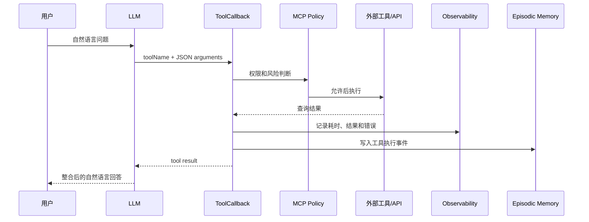

# Tool Calling 与 MCP 工具接入知识文档

## 1. 模块目标

让大模型不只生成文本，还能根据工具描述生成结构化参数，调用网页搜索、图片搜索等外部能力，并把结果重新交给模型完成回答。同时通过 MCP 将本地工具能力暴露给 Dify 等外部 Agent 平台。

## 2. 核心技术

| 技术 | 项目中的作用 |
| --- | --- |
| Spring AI `@Tool`、`@ToolParam` | 把 Java 方法声明为模型可识别的函数工具 |
| `ToolCallback`、JSON Schema | 向模型或 MCP 客户端描述工具名称、用途和参数结构 |
| Spring AI `ChatClient` | 将工具集合绑定到模型请求，执行 Tool Calling 循环 |
| Hutool HTTP/JSON | 调用 SearchAPI、Pexels API，并解析返回结果 |
| Tool Registry | 按名称或标签管理自研 `AgentTool` |
| MCP Client/Server Adapter | 消费远端 MCP 工具，或把本地 Tool/Skill 暴露给 Dify |
| Policy、Timeout、Circuit Breaker | 控制工具权限、风险、超时与连续失败 |
| Trace Context | 关联请求日志、工具调用日志和会话 ID |

## 3. 两套工具抽象

### 3.1 Spring AI 原生工具

`WebSearchTool`、`ImageSearchTool` 使用 `@Tool` 描述能力，`@ToolParam` 描述参数。`ToolRegistration` 通过 `ToolCallbacks.from(...)` 扫描注解并生成 `ToolCallback[]`，再用 `LoggingToolCallback` 包装，实现统一审计。

```text
Java @Tool 方法
  -> ToolCallbacks.from
  -> ToolCallback + JSON Schema
  -> ChatClient.toolCallbacks(...)
  -> 模型生成 tool name + arguments
  -> Java 方法执行
  -> tool result 回填模型
```

网页查询使用 SearchAPI 的 Baidu engine，提取前 5 条 `organic_results`；图片查询调用 Pexels Search API，提取 `photos[].src.medium`。解析逻辑被拆为静态方法，便于不访问外网的离线单元测试。

### 3.2 Agent Platform 工具

自研 `AgentTool` 接口统一了三个操作：

- `metadata()`：返回名称、描述、标签、必填参数、超时配置；
- `validate()`：执行前校验参数；
- `execute()`：返回统一的 `ToolExecuteResult`。

Spring 启动时，`ToolRegistryInitializer` 将所有 `AgentTool` 注册到 `InMemoryToolRegistry`。`ToolExecutionServiceImpl` 支持按名称和标签选择工具，并读取工具元数据中的超时配置。

这套抽象适合确定性任务编排；Spring AI 原生 `ToolCallback` 更适合由模型自主选择工具。

## 4. MCP 如何连接两套体系

`AgentToolCallback` 把自研 `AgentTool` 适配为 Spring AI `ToolCallback`：

1. 从 `ToolMetadata.requiredParams` 构造 JSON Schema；
2. 将 MCP JSON 入参反序列化为 `Map`；
3. 构造 `ToolExecuteRequest`；
4. 调用 `AgentTool.validate/execute`；
5. 将 `ToolExecuteResult` 序列化为 JSON。

因此，同一个本地工具既能被项目内任务编排器调用，也能通过 MCP Server 暴露给 Dify。

项目作为 MCP Client 时，`ManagedMcpToolService` 从 Spring AI `ToolCallbackProvider` 读取远端目录，并统一处理：

- 目录 TTL 缓存和手动刷新；
- allow/deny 规则和风险分级；
- 高风险工具人工确认；
- 执行超时和失败熔断；
- 敏感参数脱敏；
- request/stage 审计；
- 将执行结果写入 episodic memory。

## 5. 一次工具调用的数据流



## 6. 关键代码

- `tools/ToolRegistration.java`：原生工具集中注册与日志包装。
- `tools/WebSearchTool.java`：网页检索工具。
- `tools/ImageSearchTool.java`：图片检索工具。
- `agentplatform/tool/AgentTool.java`：自研工具协议。
- `agentplatform/registry/InMemoryToolRegistry.java`：工具注册表。
- `agentplatform/adapter/AgentToolCallback.java`：AgentTool 到 ToolCallback/MCP 的适配器。
- `mcp/management/ManagedMcpToolService.java`：MCP 工具治理和统一执行入口。

## 7. 面试表达重点

Tool Calling 是“模型如何选择并调用函数”的机制；MCP 是“不同应用如何用统一协议发现和调用工具”的连接层；Registry 和 Managed Service 则是项目内部的治理层。三者解决的问题不同，但最终共用 `ToolCallback` 和结构化参数完成衔接。

## 8. 当前边界

- 网页和图片工具依赖外部 API Key，离线测试只覆盖响应解析。
- `AgentToolCallback` 当前把必填参数统一描述为 string，复杂类型 Schema 还可继续增强。
- MCP 工具目录使用 TTL 和手动刷新，没有实现服务端 `listChanged` 推送订阅。

