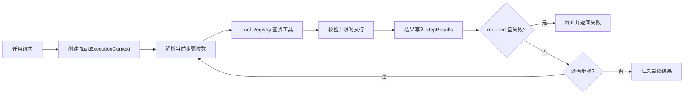

# 多步骤任务执行与结果整合知识文档

## 1. 模块目标

把一个任务拆成多个有顺序的工具步骤，使前一步结果能够成为后一步输入，并通过必选步骤、最大步数和超时控制保证执行过程可控。

当前实现属于确定性 Pipeline Orchestration：步骤由请求或预定义模板给出，执行器负责状态传递和失败处理；它不同于由 LLM 每轮动态决定下一步的完整 ReAct Agent。

## 2. 核心技术

| 技术 | 项目中的作用 |
| --- | --- |
| `TaskStepDefinition` | 描述 stepId、工具名、参数和 required 属性 |
| `TaskExecutionContext` | 保存 traceId、当前步数、最大步数和历史结果 |
| Tool Registry | 根据步骤中的 toolName 找到具体工具 |
| 参数模板 | 使用 `${step:s1}` 引用前序步骤输出 |
| Fail Fast | 必选步骤失败时立即终止；可选步骤失败后继续 |
| `CompletableFuture` + Timeout | 限制单工具最长执行时间 |
| LLM Summary Tool | 将多来源检索结果整理成结构化结论 |
| Trace ID | 关联同一任务内的多次工具调用 |

## 3. 核心模型

### TaskStepDefinition

一条步骤定义包含：

- `stepId`：供后续步骤引用；
- `toolName`：注册表中的工具名称；
- `args`：当前工具参数，可包含变量引用；
- `required`：失败后是否终止整个任务。

### TaskExecutionContext

执行上下文不是模型上下文窗口，而是任务运行状态：

```text
traceId          同一任务的链路标识
currentStep      已执行步数
maxSteps         防止无限执行
stepResults      stepId -> ToolExecuteResult
attributes       可扩展的运行时状态
```

## 4. 执行算法

`TaskOrchestratorServiceImpl.execute` 的流程：

1. 创建或复用 `traceId`；
2. 将最大步数限制在 20 以内，默认 6；
3. 按请求顺序遍历步骤；
4. 解析参数中的 `${step:<id>}`；
5. 通过 `ToolExecutionService` 按名称执行工具；
6. 将结果放入 `stepResults`；
7. required 步骤失败时终止，可选步骤失败时继续；
8. 返回执行步数、全部步骤结果和最终摘要。



## 5. 项目中的两个闭环示例

### 检索任务

```text
web_search(query)
  -> image_search(query)
  -> result_summary(searchResult=${step:s1}, imageResult=${step:s2})
```

网页搜索是必选步骤，图片搜索是可选步骤。`result_summary` 使用 Spring AI `ChatClient` 将两个结果整合为核心结论、关键信息和图片建议。

### 银河摄影任务

```text
milkyway_rise
  -> light_pollution
  -> cloud_cover（可选）
  -> astro_plan_summary
```

该流程体现多工具数据采集、可选数据源降级和最终 LLM 推理整合。

## 6. 与 ReAct 的关系

当前 Pipeline 的优势是顺序确定、容易测试、容易限制成本；不足是无法根据中间结果动态增加或改变步骤。

`ReActBridgeService` 已提供最小桥接：将 `ToolExecuteResult` 转换成新的消息观察结果并回填历史。未来如果扩展动态 Agent，可形成：

```text
Thought/Plan -> Action -> Tool Result/Observation -> 下一轮决策
```

因此项目现状应表述为“多步骤任务执行与结果整合”，而不是宣称已经实现完整自主 ReAct 推理框架。

## 7. 关键代码

- `agentplatform/service/impl/TaskOrchestratorServiceImpl.java`：任务编排主循环。
- `agentplatform/model/TaskExecutionContext.java`：运行状态。
- `agentplatform/model/TaskStepDefinition.java`：步骤定义。
- `agentplatform/service/impl/ToolExecutionServiceImpl.java`：工具选择、校验和超时。
- `agentplatform/tool/impl/ResultSummaryAgentTool.java`：LLM 结果整合。
- `agentplatform/service/ReActBridgeService.java`：工具观察结果回填桥接。

## 8. 面试表达重点

这部分的核心不是“循环调用了几个接口”，而是建立统一步骤模型和执行上下文，使参数传递、失败策略、超时限制、最大步数和链路追踪都由编排器处理，工具自身只关心单一能力。

## 9. 当前边界

- 当前步骤是顺序执行，尚未做 DAG 并行调度。
- 参数引用只支持取整个步骤输出，不支持 JSONPath 字段提取。
- `CompletableFuture` 超时后返回失败结果，但底层阻塞任务的强制取消能力仍取决于具体工具实现。

