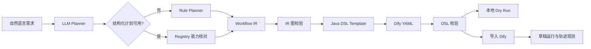

# 自然语言 Workflow Builder 知识文档

## 1. 模块目标

将自然语言需求转换为结构化 Workflow IR，再由确定性的 Java 模板生成 Dify Workflow DSL。核心原则是：LLM 负责语义规划，Java 负责结构正确性，避免让模型直接生成难以校验的 YAML。

## 2. 核心技术

| 技术 | 项目中的作用 |
| --- | --- |
| Spring AI `ChatClient` | 让 LLM 从自然语言中提取工作流名称、能力调用序列和指令 |
| Structured Output | 将模型输出反序列化为 `LlmPlan`，而不是自由文本 |
| Workflow IR | 用节点和边隔离自然语言规划与 Dify DSL |
| Tool/Skill Registry Grounding | 只允许引用项目中真实注册的能力 |
| Rule Fallback | LLM 不可用或结果非法时回退关键词规则规划 |
| Java Template + YAML | 确定性生成 Dify DSL，避免 LLM 直接拼 YAML |
| Graph Validation | 校验 start/end、ID、边引用和有向图无环 |
| Local Dry Run | 不依赖 Dify，按 IR 节点执行并返回逐步结果 |
| Dify Console API | 导入 DSL、运行草稿并回收节点轨迹 |
| ExecutionTraceRecorder | 记录规划器选择、校验和运行错误 |

## 3. Workflow IR

`WorkflowIR` 是中间表示：

```text
WorkflowIR
  id
  name
  description
  nodes: WorkflowNode[]
  edges: WorkflowEdge[]
```

当前节点类型包括：

- `start`：用户输入入口；
- `tool`：引用 `tool:<name>` 或 `skill:<name>`；
- `llm`：负责基于用户输入和工具结果完成推理；
- `answer`：输出上一节点结果。

Tool 节点的 `instruction` 保存 JSON 参数模板，例如 `{"query":"${start}"}`；`toolRef` 保存能力引用。IR 不绑定 Dify 的完整字段，因此规划、验证、本地执行和不同 DSL 后端可以复用同一个模型。

## 4. 自然语言规划

### LLM Planner

`LlmWorkflowPlanner` 让模型只输出较小的语义计划：工作流名称、有序能力调用列表、最终 LLM 指令。Java 随后负责：

1. 根据 `ToolRegistry` 和 `SkillRegistry`核对能力是否真实存在；
2. 过滤模型臆造的 tool/skill；
3. 生成节点 ID、参数模板和边；
4. 拼装 `start -> tool... -> llm -> answer`；
5. 校验 IR，非法时返回空结果。

### Rule Planner

`WorkflowPlanningService` 保存关键词到能力的映射。默认优先 LLM；模型不可用、解析失败或 IR 校验失败时回退规则规划，并在 diagnostics 中记录实际使用的规划器和回退原因。

这种设计同时保留了自然语言理解能力和稳定兜底能力。

## 5. DSL 生成与两种编排模式

`WorkflowDslGenerateService` 将 IR 转换为 Dify YAML，DSL 始终由 Java Map/模板生成。

### HTTP 模式

每个 tool/skill 转换为确定性的 HTTP 调用节点。单工具走串行链；两个及以上工具时可生成 fan-out 和聚合节点。优点是调用过程清晰、可预测。

### Agent 模式

把能力挂载到 Dify Agent 节点，由模型在迭代上限内通过 Function Calling 自主选择 MCP 工具。若 IR 中没有可挂载工具，则回退 HTTP/LLM 流程。

同时支持：

- `chatflow`：多轮对话，使用 answer 收尾；
- `workflow`：单轮运行，使用 end 收尾。

这两个维度彼此独立：HTTP/Agent 决定工具如何编排，chatflow/workflow 决定 Dify 应用形态。

## 6. 校验与执行

`WorkflowDslValidateService` 同时校验 IR 和最终 DSL：

- 必须存在 start；
- 必须存在 answer 或 end；
- 节点 ID 唯一；
- edge source/target 必须存在；
- 图中不能有环；
- DSL 必须能够解析且包含 `workflow.graph.nodes/edges`。

`WorkflowBuilderExecutionService` 支持本地 dry-run：维护 `${start}` 和 `${nodeId}` 变量，依次执行 tool、skill、LLM 和 answer 节点，并返回每一步的成功状态、输出、错误和耗时。

生成后的 DSL 还可以通过 Dify Console API 导入，并通过 `DifyRunObserveService` 执行草稿、收集节点结果和 Agent 轮次。

## 7. 完整生成链路



## 8. 关键代码

- `workflowbuilder/model/WorkflowIR.java`：中间表示。
- `workflowbuilder/service/LlmWorkflowPlanner.java`：LLM 语义规划。
- `workflowbuilder/service/WorkflowPlanningService.java`：规划入口和规则回退。
- `workflowbuilder/service/WorkflowDslGenerateService.java`：Dify DSL 模板生成。
- `workflowbuilder/service/WorkflowDslValidateService.java`：IR/DSL 图校验。
- `workflowbuilder/service/WorkflowBuilderExecutionService.java`：本地试运行。
- `workflowbuilder/controller/WorkflowBuilderController.java`：生成、验证、运行、导入和导出接口。

## 9. 面试表达重点

最关键的设计是引入 Workflow IR。它把不稳定的自然语言理解和要求严格的 Dify YAML 隔离开：LLM 只做能力选择和任务语义，Java 根据真实 Registry 组装图并校验，最终 DSL 可重复生成、可测试、可回退。

## 10. 当前边界

- IR 当前主要支持线性 tool 链，DSL 层才对多工具生成并行结构。
- 只支持 start/tool/llm/answer 四类核心节点，条件分支和循环尚未进入 IR。
- Dify Agent 插件 UID、模型 provider 等配置与具体 Dify 环境有关，需要部署时校准。

