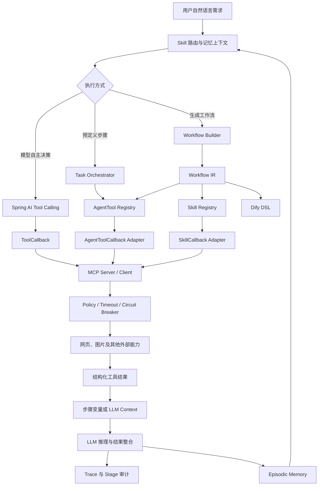

# Tool Calling、任务编排与 Workflow Builder 总知识流

## 1. 三个模块之间的关系

三个模块不是并列的功能堆叠，而是从“单能力”逐级抽象到“可生成流程”：

```text
Tool Calling / MCP
解决：一个能力如何描述、发现和调用

Task Orchestration
解决：多个能力如何传递状态、控制顺序和整合结果

Workflow Builder
解决：如何从自然语言自动生成可验证、可执行、可导出的任务图
```

## 2. 统一知识流



## 3. 一条完整请求如何流动

以“搜索某主题的资料和图片，并生成总结”为例：

1. 用户输入进入 Assistant 或 Workflow Builder；
2. 会话管理器装配近期消息、摘要和相关长期记忆；
3. 系统选择执行形态：模型 Tool Calling、固定任务步骤或 Workflow IR；
4. `web_search` 与 `image_search` 从 Registry/ToolCallback 中被发现；
5. 调用前经过权限、风险、超时和熔断治理；
6. 工具调用外部 API，返回结构化结果；
7. Pipeline 使用 `${step:s1}` 传递结果，或 Tool Calling 将结果回填模型；
8. LLM 对多来源结果进行推理和整合；
9. requestId/traceId 记录每个执行阶段；
10. 工具事件写入 episodic memory，后续相似问题可再次召回。

## 4. 共同的基础抽象

| 抽象 | 上游 | 下游 | 价值 |
| --- | --- | --- | --- |
| `ToolCallback` | Spring AI、MCP Provider | LLM/MCP 调用 | 统一函数定义和 JSON 参数 |
| `AgentTool` | 本地工具实现 | Task Orchestrator | 统一元数据、校验和执行结果 |
| Tool/Skill Registry | Spring 容器中的能力 | Planner、Executor、Adapter | 防止引用不存在的能力 |
| `TaskExecutionContext` | 多步骤请求 | 每个任务步骤 | 保存状态和前序输出 |
| `WorkflowIR` | LLM/Rule Planner | DSL Generator、Dry Run | 隔离语义规划和平台 DSL |
| Trace Context | HTTP/会话入口 | Tool、Workflow、日志 | 串联一次请求的所有阶段 |
| Hierarchical Memory | 对话和工具结果 | 下一轮上下文 | 形成跨轮执行闭环 |

## 5. 技术学习顺序

建议按以下顺序掌握和讲解：

1. 先理解函数调用：工具描述、JSON Schema、参数生成、结果回填；
2. 再理解工具工程化：Registry、统一结果、超时、审计、MCP 适配；
3. 再理解任务状态：步骤、变量引用、必选/可选、最大步数；
4. 再理解中间表示：为什么需要 Workflow IR，为什么不让 LLM 直接写 YAML；
5. 最后理解 Agent Runtime：路由、上下文、工具治理、流程执行、可观测和记忆回写如何组成闭环。

## 6. 面试中的总述

> 项目先通过 Spring AI Tool Calling 和自研 AgentTool Registry 完成外部能力标准化接入，再通过任务执行上下文实现多步骤结果传递和失败控制；在此基础上引入 Workflow IR，将自然语言规划与 Dify DSL 生成解耦，并用 Registry 校验、规则回退、图校验、本地试运行和链路审计保证生成流程可执行。工具结果进一步写入情景记忆，在后续会话中按相关性召回，形成完整 Agent Runtime 闭环。

## 7. 对应文档

- [Tool Calling 与 MCP 工具接入](./01_TOOL_CALLING_AND_MCP.md)
- [多步骤任务执行与结果整合](./02_TASK_ORCHESTRATION.md)
- [自然语言 Workflow Builder](./03_WORKFLOW_BUILDER.md)
